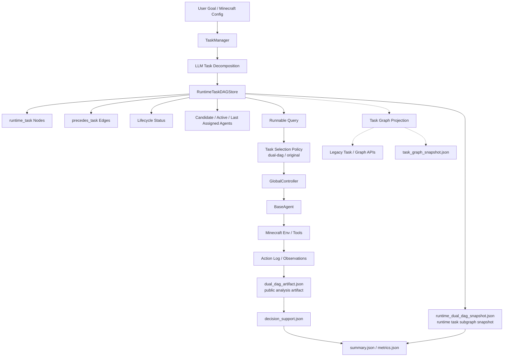
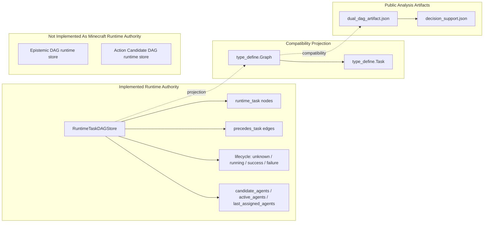
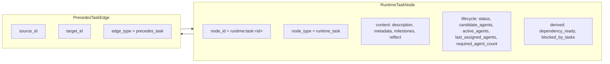
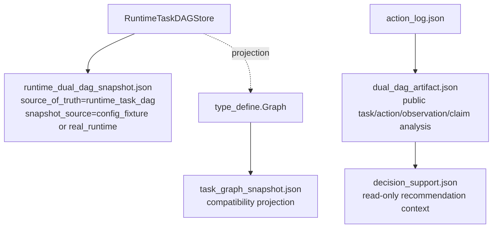
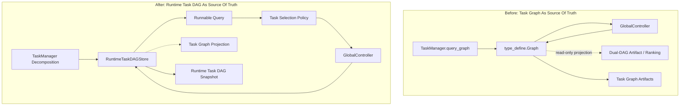

# Architecture Diagrams

This document visualizes the current runtime architecture after the task-store migration. `RuntimeTaskDAGStore` is the source of truth for runtime task dependency and lifecycle state. It is not the full Dual-DAG runtime: Epistemic DAG and Action Candidate DAG runtime stores remain future implementation targets for Minecraft.

## Current Architecture



## Runtime Boundary



## Runnable Path

Runnable-task filtering is centralized in the runtime task DAG store. The controller supplies current free agents, then applies only policy ordering and final assignment validation.

```mermaid
sequenceDiagram
    participant GC as GlobalController
    participant TM as TaskManager
    participant RTS as RuntimeTaskDAGStore
    participant POL as Task Selection Policy
    participant AG as BaseAgent / Env

    GC->>GC: compute free_agent_names
    GC->>TM: query_runnable_subtasks(free_agent_names)
    TM->>RTS: query_runnable_tasks(free_agent_names)
    RTS-->>TM: tasks with status unknown, dependencies satisfied, enough eligible free agents
    TM-->>GC: runnable projected Tasks
    GC->>POL: order runnable tasks
    POL-->>GC: original or dual-dag ranked order
    GC->>GC: select exactly required_agent_count eligible agents and reserve them
    GC->>TM: mark_task_running(task, agents)
    TM->>RTS: lifecycle.status = running; active_agents set
    GC->>AG: execute selected task once per assigned agent
    AG-->>GC: per-agent futures and reflection results
    GC->>GC: all agents success => success; any failure/timeout => failure
    GC->>TM: mark_task_status(task.id, success/failure, feedback)
    TM->>RTS: terminal status; active_agents cleared; last_assigned_agents preserved
```

Runnable conditions:

- `status == unknown`.
- All transitive predecessors are `success`.
- `candidate_agents` and free agents overlap by at least `required_agent_count`.
- If `candidate_agents` is empty, all current free agents are candidates.
- The controller selects only `required_agent_count` agents; extra candidates do not prevent assignment.
- Accepted assignments update controller state immediately, allowing later independent tasks to use only the free agents that remain in the same scheduler iteration.
- A multi-agent assignment is one execution group. All assigned agents execute the task, and the controller writes exactly one terminal status with per-agent results after the full group completes or times out.

## Runtime Task Node Schema



`available` is not stored as canonical lifecycle state. It is derived from task status, predecessor status, free agents, candidates, and required agent count.

## Artifact Boundary



`runtime_dual_dag_snapshot.json` keeps its filename for compatibility, but it should be read as the runtime task subgraph snapshot, not as a complete Dual-DAG runtime snapshot.

## Before / After



## Paper Figure Layout

```text
+--------------------------------------------------------------------------------+
|                                 Proposed Method                                |
+--------------------------------------------------------------------------------+
| Input: User Goal / Minecraft Config                                            |
|        v                                                                       |
| TaskManager + LLM Decomposition                                                |
|        v                                                                       |
| RuntimeTaskDAGStore                                                            |
|   - runtime_task nodes                                                         |
|   - precedes_task edges                                                        |
|   - lifecycle status                                                           |
|   - candidate / active / last assigned agents                                  |
|        |                              |                                        |
|        v                              v                                        |
| Runnable Query + Policy           Compatibility Projection                     |
|   original / dual-dag              type_define.Graph / Task                    |
|        |                           task_graph_snapshot.json                    |
|        v                                                                       |
| GlobalController -> BaseAgent -> Minecraft Tools                               |
|        v                                                                       |
| Public Analysis Artifacts                                                      |
|   action_log.json                                                              |
|   runtime_dual_dag_snapshot.json (runtime task subgraph)                       |
|   dual_dag_artifact.json (analysis projection)                                 |
|   decision_support.json                                                        |
|   summary.json / metrics.json                                                  |
+--------------------------------------------------------------------------------+
```

Suggested visual encoding:

- Use a thick border around `RuntimeTaskDAGStore` to indicate task dependency/lifecycle source-of-truth ownership.
- Use dashed arrows from `RuntimeTaskDAGStore` to `Task Graph Projection` to show derived compatibility state.
- Use solid arrows for lifecycle writes from `GlobalController` through `TaskManager` back to `RuntimeTaskDAGStore`.
- Use a muted color for legacy `Task` / `Graph` APIs.
- Use a separate artifact lane at the bottom for reproducibility outputs.

## Current Guarantees

- `RuntimeTaskDAGStore` owns runtime task lifecycle and dependency state.
- `TaskManager.graph` is regenerated from runtime task DAG state.
- `GlobalController` obtains runnable tasks through `TaskManager.query_runnable_subtasks()` and writes task running/success/failure state through `TaskManager` into the runtime task DAG.
- Minecraft benchmark runs always emit `runtime_dual_dag_snapshot.json` with `snapshot_source`.
- `task_graph_snapshot.json` is retained as a compatibility projection.
- Minecraft `dual_dag_artifact.json` is a public analysis artifact over tasks, actions, observations, and claims. It is not the runtime source of truth.
- Epistemic DAG runtime state and Action Candidate DAG runtime state are future implementation targets for Minecraft.
