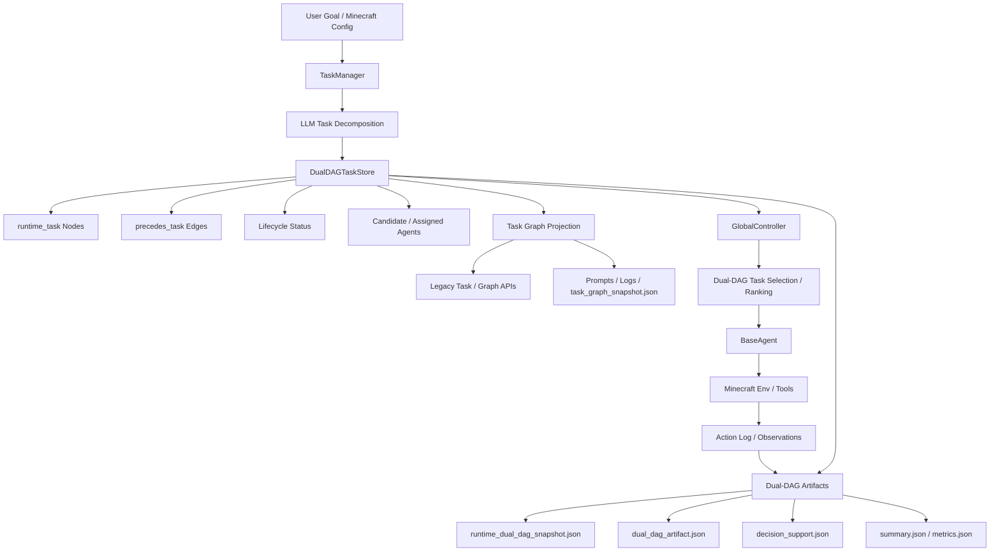
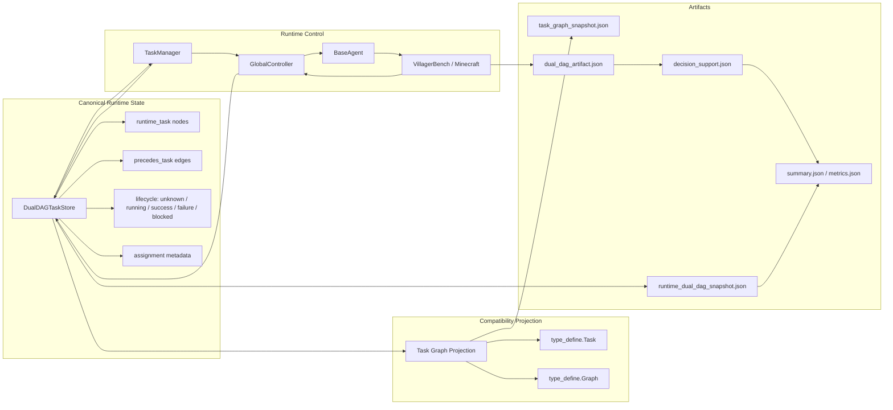
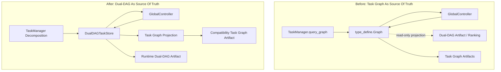

# Architecture Diagrams

This document visualizes the current proposed method after the Dual-DAG runtime integration. The key architectural change is that `DualDAGTaskStore` is the runtime source of truth, while `type_define.Graph` remains a compatibility projection.

## Current Architecture



## Runtime Responsibility View



## Before / After



## Paper Figure Layout

Use this layout for a paper or slide figure. It is intentionally not tied to Mermaid syntax, so it can be redrawn in TikZ, SVG, Illustrator, or Keynote.

```text
+--------------------------------------------------------------------------------+
|                                 Proposed Method                                |
+--------------------------------------------------------------------------------+
| Input                                                                          |
|   User Goal / Minecraft Config                                                 |
|        |                                                                       |
|        v                                                                       |
| Task Generation                                                                |
|   TaskManager + LLM Decomposition                                              |
|        |                                                                       |
|        v                                                                       |
| Canonical Runtime State                                                        |
|   DualDAGTaskStore                                                             |
|     - runtime_task nodes                                                       |
|     - precedes_task edges                                                      |
|     - lifecycle state                                                          |
|     - agent assignment metadata                                                |
|        |                              |                                        |
|        v                              v                                        |
| Controller Loop                  Compatibility Projection                      |
|   GlobalController                type_define.Graph / Task                     |
|   BaseAgent                       task_graph_snapshot.json                     |
|   Minecraft Tools                                                             |
|        |                                                                       |
|        v                                                                       |
| Evidence / Artifacts                                                           |
|   action_log.json                                                              |
|   runtime_dual_dag_snapshot.json                                               |
|   dual_dag_artifact.json                                                       |
|   decision_support.json                                                        |
|   summary.json / metrics.json                                                  |
+--------------------------------------------------------------------------------+
```

Suggested visual encoding:

- Use a thick border around `DualDAGTaskStore` to indicate source-of-truth ownership.
- Use dashed arrows from `DualDAGTaskStore` to `Task Graph Projection` to show derived compatibility state.
- Use solid arrows for lifecycle writes from `GlobalController` back to `DualDAGTaskStore`.
- Use a muted color for legacy `Task` / `Graph` APIs.
- Use a separate artifact lane at the bottom for reproducibility outputs.

## TikZ Sketch

The following is a compact TikZ skeleton that can be pasted into a LaTeX paper and styled further.

```tex
\begin{tikzpicture}[
  node distance=1.2cm and 1.5cm,
  box/.style={draw, rounded corners, align=center, minimum width=3.2cm, minimum height=0.9cm},
  source/.style={box, very thick, fill=blue!8},
  compat/.style={box, dashed, fill=gray!8},
  artifact/.style={box, fill=green!8},
  arrow/.style={->, thick}
]
\node[box] (input) {User Goal /\\Minecraft Config};
\node[box, below=of input] (tm) {TaskManager +\\LLM Decomposition};
\node[source, below=of tm] (dag) {DualDAGTaskStore\\Source of Truth};
\node[box, below left=of dag] (ctrl) {GlobalController\\BaseAgent};
\node[compat, below right=of dag] (graph) {Task Graph\\Projection};
\node[box, below=of ctrl] (env) {VillagerBench /\\Minecraft Tools};
\node[artifact, below=of dag, yshift=-2.4cm] (artifacts) {runtime\_dual\_dag\_snapshot.json\\dual\_dag\_artifact.json\\summary / metrics};

\draw[arrow] (input) -- (tm);
\draw[arrow] (tm) -- (dag);
\draw[arrow] (dag) -- (ctrl);
\draw[arrow] (ctrl) -- (env);
\draw[arrow] (env.west) .. controls +(-1.2,-0.2) and +(-1.2,0.2) .. (ctrl.west);
\draw[arrow] (ctrl) -- node[left]{lifecycle writes} (dag);
\draw[arrow, dashed] (dag) -- (graph);
\draw[arrow] (dag) -- (artifacts);
\draw[arrow, dashed] (graph) -- (artifacts);
\end{tikzpicture}
```

## Current Guarantees

- `DualDAGTaskStore` owns runtime task lifecycle and dependency state.
- `TaskManager.graph` is regenerated from Dual-DAG state.
- `GlobalController` writes task running/success/failure state through `TaskManager` into Dual-DAG.
- Minecraft benchmark runs always emit `runtime_dual_dag_snapshot.json`.
- `task_graph_snapshot.json` is retained as a compatibility projection.
