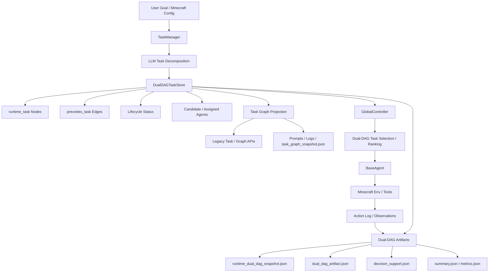
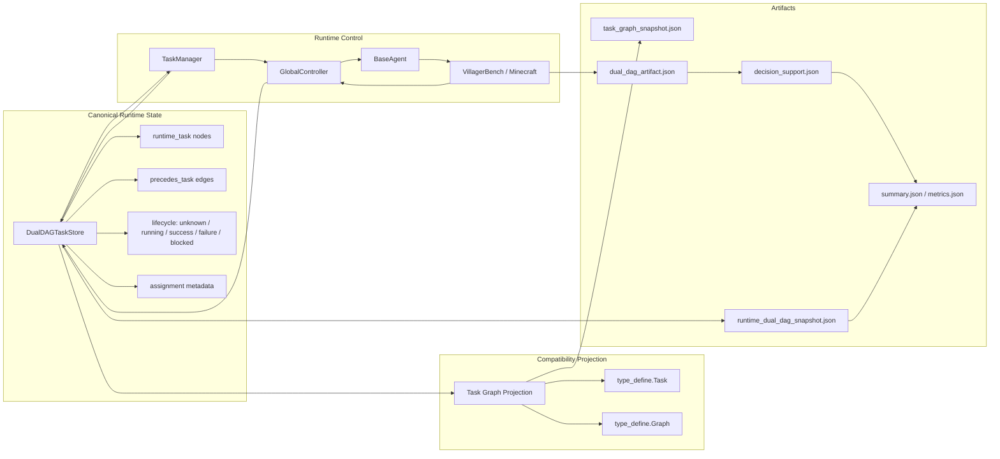
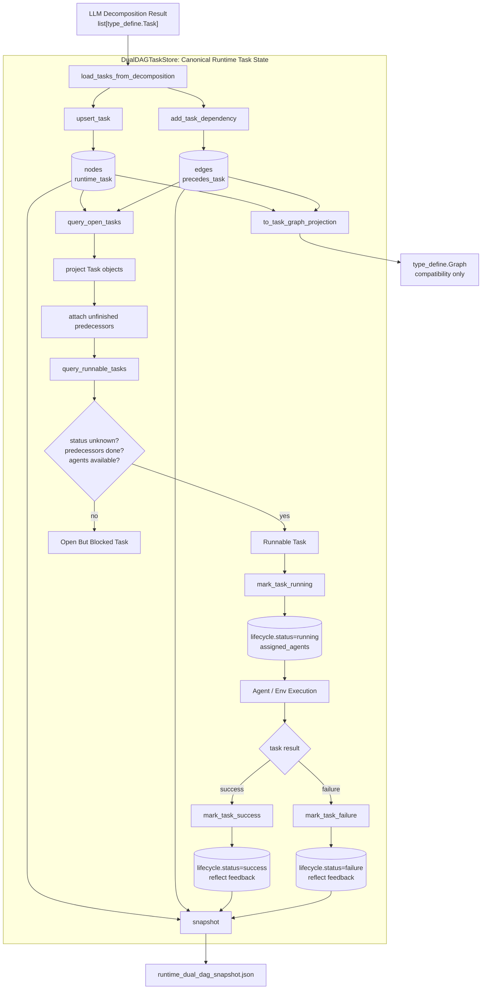
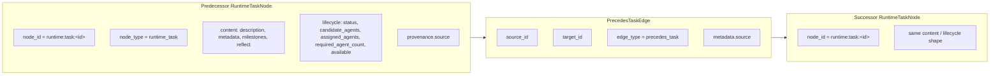
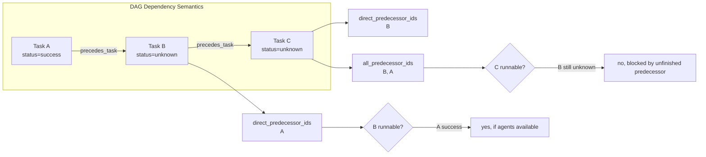
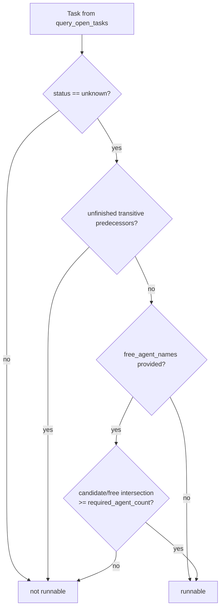
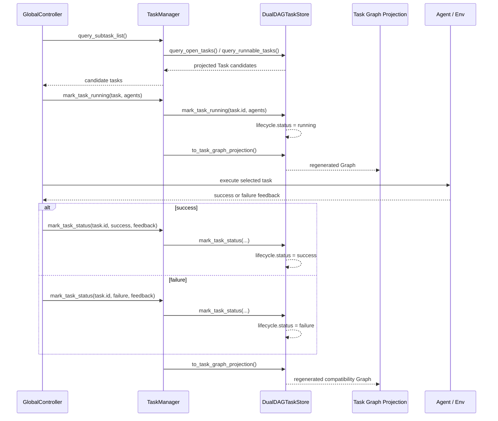
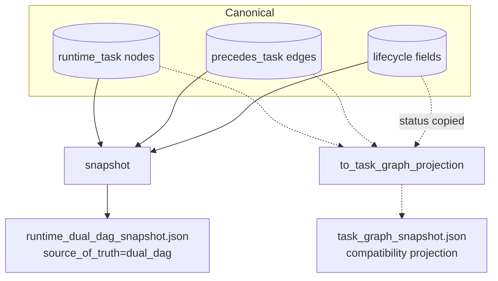
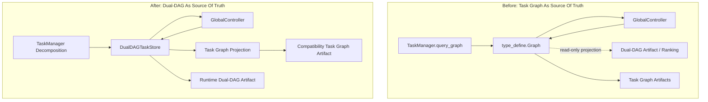

# Architecture Diagrams

This document visualizes the current proposed method after the Dual-DAG runtime integration. The key architectural change is that `DualDAGTaskStore` is the runtime source of truth, while `type_define.Graph` remains a compatibility projection.

## Current Architecture



## Runtime Responsibility View



## Dual-DAG Internal Operation

This view zooms into `DualDAGTaskStore`, excluding the rest of the controller architecture. It shows how runtime task state moves through the store from LLM decomposition to scheduling, lifecycle updates, and exported artifacts.



## Runtime Task Node Schema

Each runtime task is represented as a Dual-DAG node. The task graph view is rebuilt from these nodes, so this schema is the authoritative state shape for runtime task lifecycle.



Status values used by the runtime task store:

- `unknown`: created but not yet assigned or completed.
- `running`: selected by the controller and assigned to one or more agents.
- `success`: completed successfully; downstream dependencies may become runnable.
- `failure`: terminal failure; the overall terminal state becomes failure.

## Dependency And Runnable Semantics

`precedes_task` means the target task depends on the source task. A task is runnable only when it is still `unknown`, all transitive predecessors are successful, and enough free agents match the candidate set.



Runnable-task filtering follows this decision order:



## Lifecycle Write-Back Loop

The controller does not mutate the compatibility graph as an authority. It writes lifecycle changes through `TaskManager`, which updates Dual-DAG and then rebuilds `TaskManager.graph` as a projection.



## Snapshot And Projection Boundary

Dual-DAG emits the canonical runtime snapshot. The legacy graph snapshot is derived and should be interpreted as a compatibility artifact.



## Before / After



## Paper Figure Layout

Use this layout for a paper or slide figure. It is intentionally not tied to Mermaid syntax, so it can be redrawn in TikZ, SVG, Illustrator, or Keynote.

```text
+--------------------------------------------------------------------------------+
|                                 Proposed Method                                |
+--------------------------------------------------------------------------------+
| Input                                                                          |
|   User Goal / Minecraft Config                                                 |
|        |                                                                       |
|        v                                                                       |
| Task Generation                                                                |
|   TaskManager + LLM Decomposition                                              |
|        |                                                                       |
|        v                                                                       |
| Canonical Runtime State                                                        |
|   DualDAGTaskStore                                                             |
|     - runtime_task nodes                                                       |
|     - precedes_task edges                                                      |
|     - lifecycle state                                                          |
|     - agent assignment metadata                                                |
|        |                              |                                        |
|        v                              v                                        |
| Controller Loop                  Compatibility Projection                      |
|   GlobalController                type_define.Graph / Task                     |
|   BaseAgent                       task_graph_snapshot.json                     |
|   Minecraft Tools                                                             |
|        |                                                                       |
|        v                                                                       |
| Evidence / Artifacts                                                           |
|   action_log.json                                                              |
|   runtime_dual_dag_snapshot.json                                               |
|   dual_dag_artifact.json                                                       |
|   decision_support.json                                                        |
|   summary.json / metrics.json                                                  |
+--------------------------------------------------------------------------------+
```

Suggested visual encoding:

- Use a thick border around `DualDAGTaskStore` to indicate source-of-truth ownership.
- Use dashed arrows from `DualDAGTaskStore` to `Task Graph Projection` to show derived compatibility state.
- Use solid arrows for lifecycle writes from `GlobalController` back to `DualDAGTaskStore`.
- Use a muted color for legacy `Task` / `Graph` APIs.
- Use a separate artifact lane at the bottom for reproducibility outputs.

## TikZ Sketch

The following is a compact TikZ skeleton that can be pasted into a LaTeX paper and styled further.

```tex
\begin{tikzpicture}[
  node distance=1.2cm and 1.5cm,
  box/.style={draw, rounded corners, align=center, minimum width=3.2cm, minimum height=0.9cm},
  source/.style={box, very thick, fill=blue!8},
  compat/.style={box, dashed, fill=gray!8},
  artifact/.style={box, fill=green!8},
  arrow/.style={->, thick}
]
\node[box] (input) {User Goal /\\Minecraft Config};
\node[box, below=of input] (tm) {TaskManager +\\LLM Decomposition};
\node[source, below=of tm] (dag) {DualDAGTaskStore\\Source of Truth};
\node[box, below left=of dag] (ctrl) {GlobalController\\BaseAgent};
\node[compat, below right=of dag] (graph) {Task Graph\\Projection};
\node[box, below=of ctrl] (env) {VillagerBench /\\Minecraft Tools};
\node[artifact, below=of dag, yshift=-2.4cm] (artifacts) {runtime\_dual\_dag\_snapshot.json\\dual\_dag\_artifact.json\\summary / metrics};

\draw[arrow] (input) -- (tm);
\draw[arrow] (tm) -- (dag);
\draw[arrow] (dag) -- (ctrl);
\draw[arrow] (ctrl) -- (env);
\draw[arrow] (env.west) .. controls +(-1.2,-0.2) and +(-1.2,0.2) .. (ctrl.west);
\draw[arrow] (ctrl) -- node[left]{lifecycle writes} (dag);
\draw[arrow, dashed] (dag) -- (graph);
\draw[arrow] (dag) -- (artifacts);
\draw[arrow, dashed] (graph) -- (artifacts);
\end{tikzpicture}
```

## Current Guarantees

- `DualDAGTaskStore` owns runtime task lifecycle and dependency state.
- `TaskManager.graph` is regenerated from Dual-DAG state.
- `GlobalController` writes task running/success/failure state through `TaskManager` into Dual-DAG.
- Minecraft benchmark runs always emit `runtime_dual_dag_snapshot.json`.
- `task_graph_snapshot.json` is retained as a compatibility projection.
